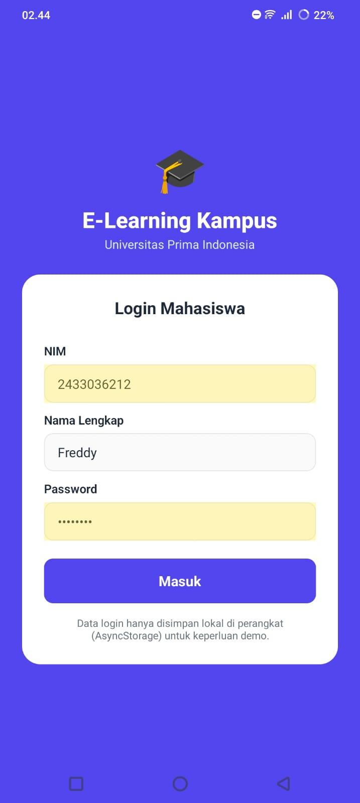
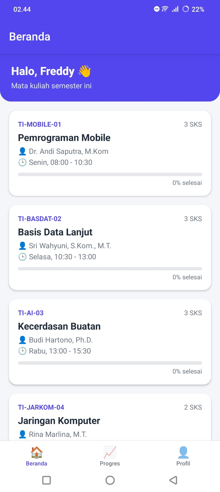
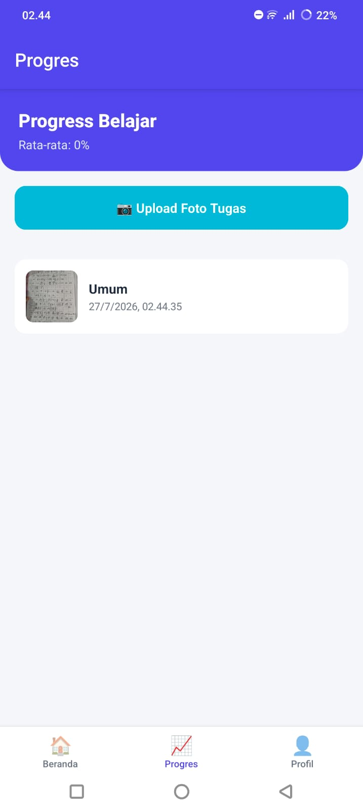

# E-Learning Kampus — Domain: E-Learning Kampus


> Aplikasi platform belajar online untuk mahasiswa Universitas Prima Indonesia. Mahasiswa dapat login, melihat daftar mata kuliah, membaca materi per matkul, melacak progress belajar, dan mengunggah foto tugas — semua tersimpan secara lokal di perangkat.

---

## 📸 Screenshots

| Login Screen | Home Screen | Feature Screen |
|:---:|:---:|:---:|
|  |  |  |

> Ganti gambar di atas dengan screenshot asli aplikasi kamu sebelum submit (folder `assets/screenshots/`).

---

## ✨ Fitur Utama

- [x] Login mahasiswa dengan validasi form (NIM, nama, password) + AsyncStorage
- [x] Daftar Mata Kuliah dengan FlatList (dummy data terstruktur, simulasi API)
- [x] Detail matkul: deskripsi, jadwal, dosen, dan daftar materi (route.params)
- [x] Progress belajar per matkul tersimpan lokal (AsyncStorage), auto update saat materi ditandai selesai
- [x] Upload foto tugas via expo-image-picker, lengkap dengan permission handling
- [x] Riwayat upload tugas ditampilkan dengan FlatList + empty state
- [x] Data persisten dengan AsyncStorage (sesi user, progress, riwayat tugas)
- [x] Bottom Tab Navigation (Beranda, Progres, Profil) + Stack Navigation (Login → MainTabs → Detail)
- [x] Loading state (ActivityIndicator) di setiap layar yang memuat data async
- [x] Conditional rendering untuk loading / empty / data-terisi di setiap screen

---

## 🛠️ Tech Stack

| Layer | Teknologi |
|-------|-----------|
| Framework | React Native + Expo (SDK 51) |
| Navigation | React Navigation v6 (Native Stack + Bottom Tab) |
| Storage | @react-native-async-storage/async-storage |
| Device | expo-image-picker |
| Build | EAS Build (Expo Application Services) |

---

## 📁 Struktur Folder

```
ELearningKampus-UAS/
├── App.js
├── app.json
├── eas.json
├── babel.config.js
├── package.json
├── src/
│   ├── navigation/AppNavigator.js
│   ├── screens/
│   │   ├── LoginScreen.js
│   │   ├── HomeScreen.js
│   │   ├── DetailScreen.js
│   │   ├── ProgressScreen.js
│   │   └── ProfileScreen.js
│   ├── components/
│   │   ├── ItemCard.js
│   │   ├── LoadingSpinner.js
│   │   └── EmptyState.js
│   ├── services/
│   │   ├── storage.js
│   │   └── api.js
│   └── constants/colors.js
└── assets/
```

---

## 🚀 Cara Menjalankan

```bash
git clone https://github.com/yantaubing/ELEARNINGKAMPUS/
cd ELearningKampus-UAS
npm install
npx expo start
```

Scan QR Code dengan Expo Go di HP (pastikan HP & laptop di WiFi yang sama).

---

## 📦 Build APK (EAS Build)

```bash
npm install -g eas-cli
eas login
eas build:configure
eas build --platform android --profile preview
```

Setelah build selesai, unduh APK dari dashboard [expo.dev](https://expo.dev) lalu upload ke GitHub Release atau Google Drive.

### Download APK

[Download APK terbaru](https://expo.dev/accounts/yantaubing050805/projects/e-learning-kampus/builds/644f5493-5d3d-4e71-9cc2-0b40a945e808)

---

## 🌐 Expo Snack

[Buka di Expo Snack](https://snack.expo.dev/@yantaubing050805/elearningkampus)

---

## 👤 Developer

**[FREDDY]** | [243303621223] | [4 PAGI A]
Universitas Prima Indonesia — Prodi Sistem Informasi
Mata Kuliah: Pemrograman Mobile (TI-MOBILE-01)
"# ELEARNINGKAMPUS" 
